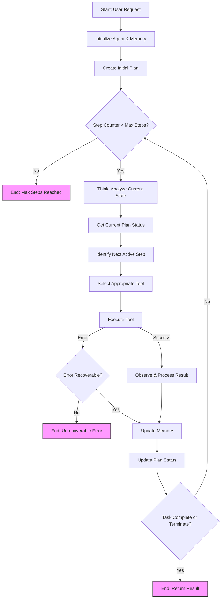
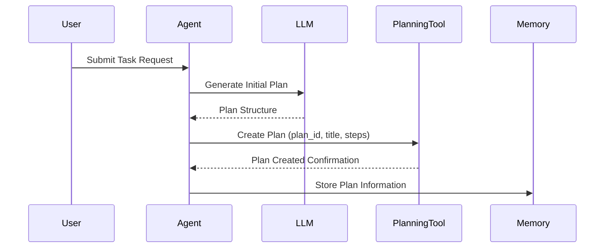
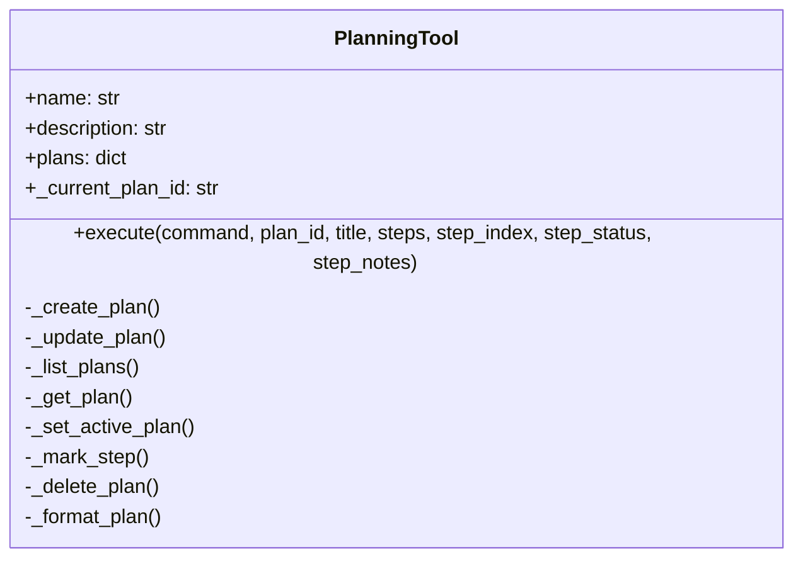

# OpenManus Agent Workflow & Planning System

## Introduction

OpenManus implements a sophisticated AI agent system capable of solving complex tasks through a methodical process of planning, tool selection, execution, and observation. This document explains the internal architecture and workflow of the OpenManus agent, with special attention to its planning mechanism and the 20-step execution limit.

## Core Execution Loop

The following diagram illustrates the fundamental workflow of an OpenManus agent:



## Planning System Architecture

OpenManus implements a robust planning system through two key components:

1. **PlanningTool**: A specialized tool class that provides functionality for creating and managing plans
2. **PlanningAgent**: An agent that leverages the PlanningTool to create, track, and execute multistep plans

The relationship between these components enables the agent to:
- Break down complex tasks into discrete, manageable steps
- Track progress through each step
- Maintain an organized record of completed and pending actions
- Execute the appropriate tools for each step

## Detailed Workflow Breakdown

### 1. Initialization & Plan Creation

When a user submits a request, the agent:



- Initializes the agent memory with the user's request
- Generates a unique `plan_id` (e.g., using timestamp: `plan_1234567890`)
- Uses the LLM to analyze the request and develop a structured plan with discrete steps
- Creates the plan using the PlanningTool, storing:
  - Plan title (descriptive name for the task)
  - Sequential steps needed to complete the task
  - Status tracking for each step (not_started, in_progress, completed, blocked)

### 2. Think & Step Identification

For each iteration of the execution loop, the agent:

- Checks if the current step count is less than the maximum step limit (default: 20)
- Retrieves the current plan status using `get_plan()`
- Identifies the first non-completed step (with status "not_started" or "in_progress")
- Marks the current step as "in_progress" in the plan
- Passes the plan status to the LLM to determine how to approach the current step

### 3. Tool Selection & Execution

Based on the current step requirements, the agent:

- Selects the appropriate tool to accomplish the current step
- Prepares the necessary parameters for the tool
- Executes the tool, potentially in a sandboxed environment for security
- Records the tool execution in the step_execution_tracker, associating it with:
  - The current step index
  - The tool name
  - Execution status ("pending", later updated to "completed")

### 4. Observation & Memory Update

After tool execution, the agent:

- Observes the result or output from the tool
- Captures any errors that occurred during execution
- Updates the agent's memory with the tool response
- Associates the result with the current step in the execution tracker

### 5. Plan Status Update

The agent then updates the plan status:

- Marks the current step as "completed" if the tool execution was successful
- Alternatively, marks it as "blocked" if there were issues
- Updates the plan's progress statistics (e.g., "3/7 steps completed (42.8%)")
- Stores any notes or additional information relevant to the step

### 6. Termination Check

After updating the plan, the agent checks if:

- All steps in the plan have been completed
- A specific Terminate tool has been called
- The maximum step limit has been reached
- An unrecoverable error has occurred

If any termination condition is met, the agent ends execution and returns the final result. Otherwise, it loops back to the "Think" phase and continues with the next step.

## The 20-Step Execution Limit

OpenManus implements a configurable step limit (default: 20) to ensure controlled, efficient execution:

```python
# From PlanningAgent class
max_steps: int = 20
```

This limit serves several critical purposes:

1. **Prevents Infinite Loops**: Ensures the agent doesn't get stuck in repetitive or circular reasoning patterns
2. **Resource Management**: Controls computational resources and API costs by capping the number of LLM calls
3. **Timely Completion**: Guarantees that tasks will complete within a reasonable timeframe
4. **Error Mitigation**: Limits potential damage from flawed execution paths or logic errors

Each iteration of the think-select-execute cycle increments the step counter. When this counter reaches the maximum, the agent terminates and returns the work completed thus far, along with an appropriate message indicating the step limit was reached.

## Planning Tool Capabilities

The PlanningTool provides comprehensive functionality for plan management:



### Key Commands:

- **create**: Establishes a new plan with title and sequential steps
- **update**: Modifies an existing plan's title or steps
- **list**: Displays all available plans and their progress
- **get**: Retrieves detailed information about a specific plan
- **set_active**: Sets a plan as the current focus
- **mark_step**: Updates a step's status (not_started, in_progress, completed, blocked)
- **delete**: Removes a plan from the system

### Step Status Tracking:

Each step in a plan can have one of four statuses:
- **not_started** `[ ]`: Step hasn't been attempted yet
- **in_progress** `[→]`: Step is currently being worked on
- **completed** `[✓]`: Step has been successfully completed
- **blocked** `[!]`: Step can't proceed due to an issue

## Conclusion

The OpenManus agent employs a sophisticated planning and execution system that enables it to break down complex tasks into manageable steps, track progress, and methodically work through solutions. Through its LLM-powered reasoning, structured planning capabilities, and diverse toolkit, the agent can solve multifaceted problems while operating within defined constraints like the 20-step execution limit.

This architecture provides a powerful, flexible framework for AI agents that can adapt to a wide range of tasks while maintaining predictable, controlled behavior.
