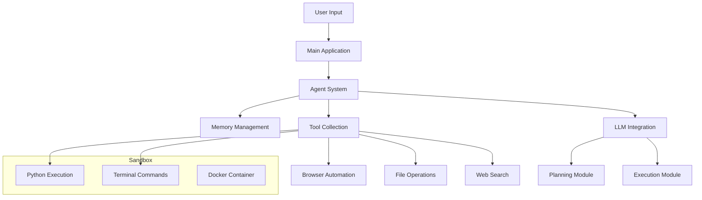
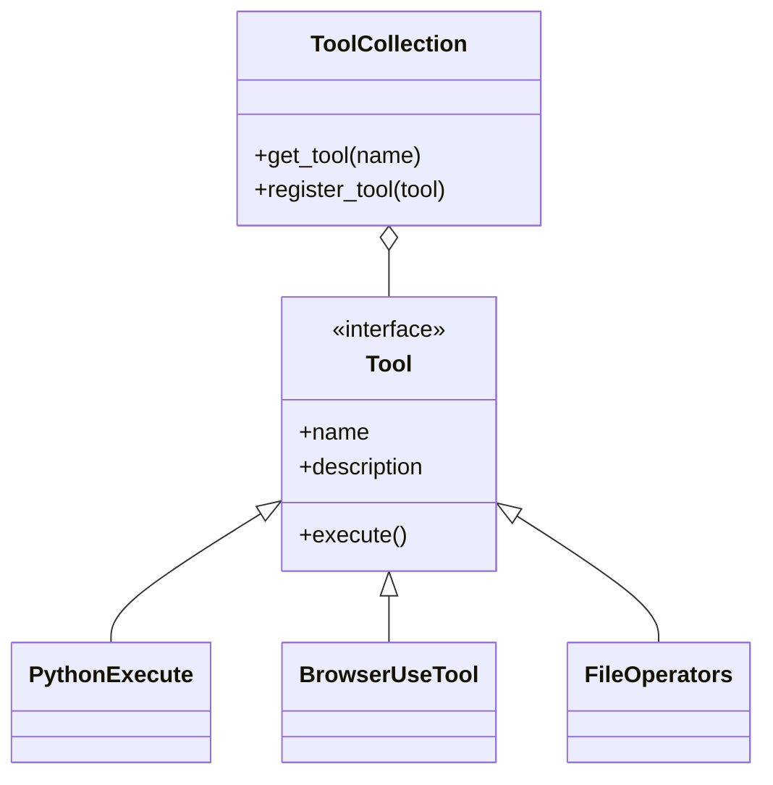
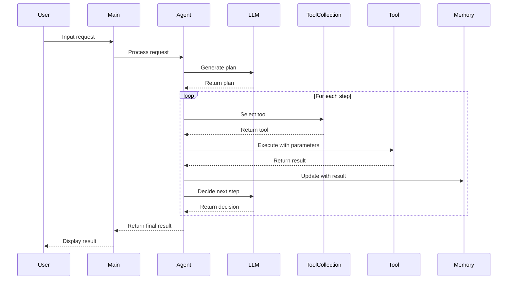
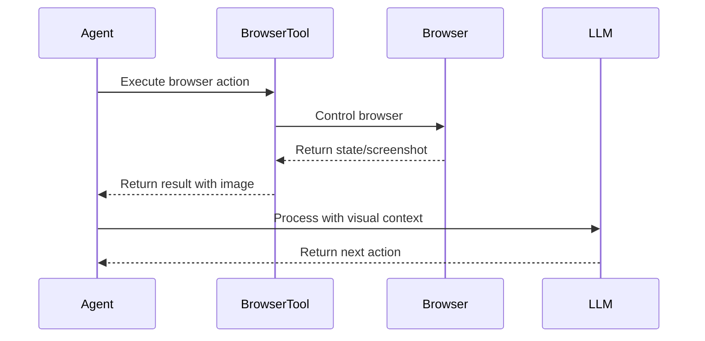

# OpenManus System Patterns

## System Architecture

OpenManus follows a modular, layered architecture designed for flexibility and extensibility:

### Core Components

1. **Agent System**: The central orchestration layer that manages the execution flow, memory, and tool selection.
2. **Memory Management**: Stores conversation history, execution results, and context for decision-making.
3. **Tool Collection**: A registry of available tools that the agent can use to accomplish tasks.
4. **LLM Integration**: Connects to language models for reasoning, planning, and decision-making.
5. **Sandbox Environment**: Provides isolated execution for potentially risky operations.

## Key Technical Decisions

### 1. Agent Hierarchy

OpenManus implements a hierarchical agent structure:

- **BaseAgent**: Abstract foundation with core functionality (memory, state management, execution loop)
- **ToolCallAgent**: Extends BaseAgent with tool execution capabilities
- **BrowserAgent**: Extends ToolCallAgent with browser-specific functionality
- **Manus**: The main agent class that combines all capabilities

This hierarchy allows for specialized agent types while maintaining a consistent interface and shared functionality.

### 2. Tool Abstraction

Tools are implemented as standalone classes with a consistent interface, allowing for:
- Easy addition of new tools
- Consistent error handling
- Uniform integration with the agent system

### 3. Memory Model

The memory system uses a message-based approach, storing interactions as a sequence of messages with different roles (user, system, assistant, tool). This approach:
- Aligns with LLM conversation formats
- Provides clear context for decision-making
- Enables effective prompt construction

### 4. Sandbox Isolation

For security and stability, potentially risky operations (like Python code execution) can be isolated in a Docker container, providing:
- Protection against malicious code
- Resource limitations
- Clean execution environment

## Design Patterns in Use

### 1. Strategy Pattern

The agent system uses the Strategy pattern to select and execute different tools based on the current context and requirements.

### 2. Observer Pattern

The agent implements an observer-like pattern for monitoring execution state and detecting issues like infinite loops or stuck states.

### 3. Factory Pattern

The system uses factory methods to create appropriate agent instances and tool collections based on configuration.

### 4. Context Manager Pattern

State transitions and resource management use context managers to ensure proper cleanup and state restoration.

### 5. Dependency Injection

Components like LLM clients and tool collections are injected into agents, promoting loose coupling and testability.

## Component Relationships

### Agent and Tools Interaction

### Browser Automation Flow

## Extension Points

OpenManus is designed with several key extension points:

1. **New Tools**: Add new capabilities by implementing the Tool interface
2. **Custom Agents**: Create specialized agents for specific domains
3. **Alternative LLMs**: Support different language models through the LLM abstraction
4. **Enhanced Sandboxing**: Customize the sandbox environment for different security requirements
5. **Additional Prompts**: Modify system and task-specific prompts for different behaviors

These extension points allow the system to evolve and adapt to new requirements without major architectural changes.
